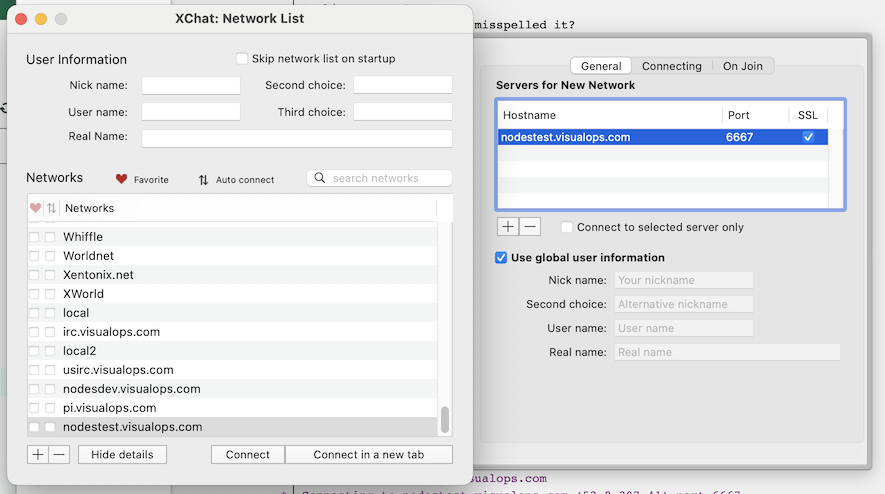
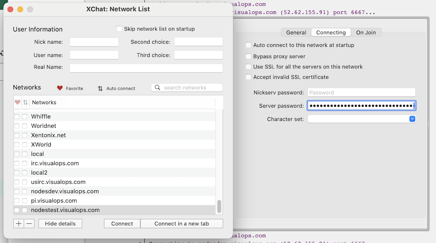
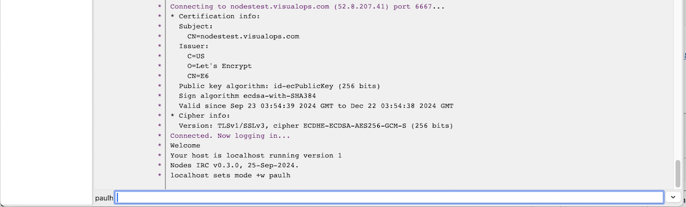
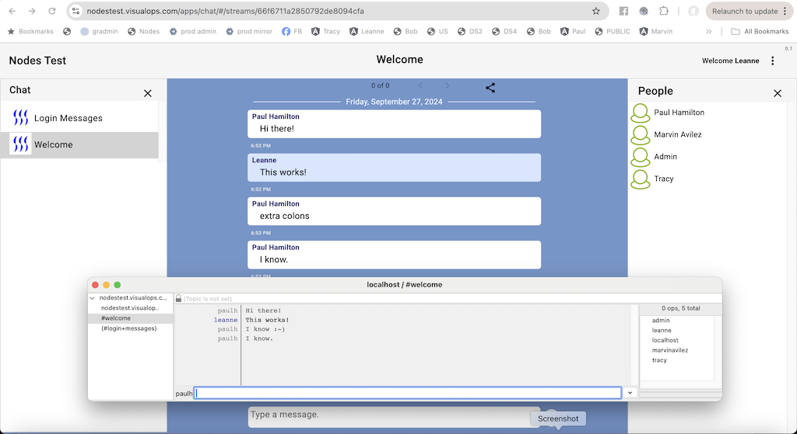

# IRC Manual

This manual describes connecting to a Nodes server using an IRC client.

## Prerequsists

On the servers you are connecting to, you will need to make sure that the "Username"
field is set to something which will become the NICK for that user.

## WeeChat

```
brew install weechat
weechat
```

### Adding a server and setting your VID

Our implementation uses port 6667 which is the default and SSL, so set those options on your

```
/server add whatever whatever.com/6667 -tls
/set irc.server.whatever.password "Your VID"
```

### Connecting to a server:

```
/connect whatever
```

### Listing the channels

In nodes, we equate "Channels" to "Streams".

```
/list
```
The stream names have been lowercased, had the spaces changed to "+" and have a "#" at the start.

### Joining a stream

```
/join #welcome
```

### Sending a messages

Once you have joined a channel you can just type messages.

## XChat

Install XChat on your mac, and then open it and choose "Network List" from the
File menu.

You see a place where you can add your server:



So add your server to the list, click on the new entry and click the "Show details" button,
and then add the actual server DNS entry and click "SSL".

Now choose the "Connecting" tab and paste your VID into "Server password".



Now click "Connect" and you'll see something similar to this:



Now you can chat between your "web" interface and the IRC one. Or have others connect
and chat away.



