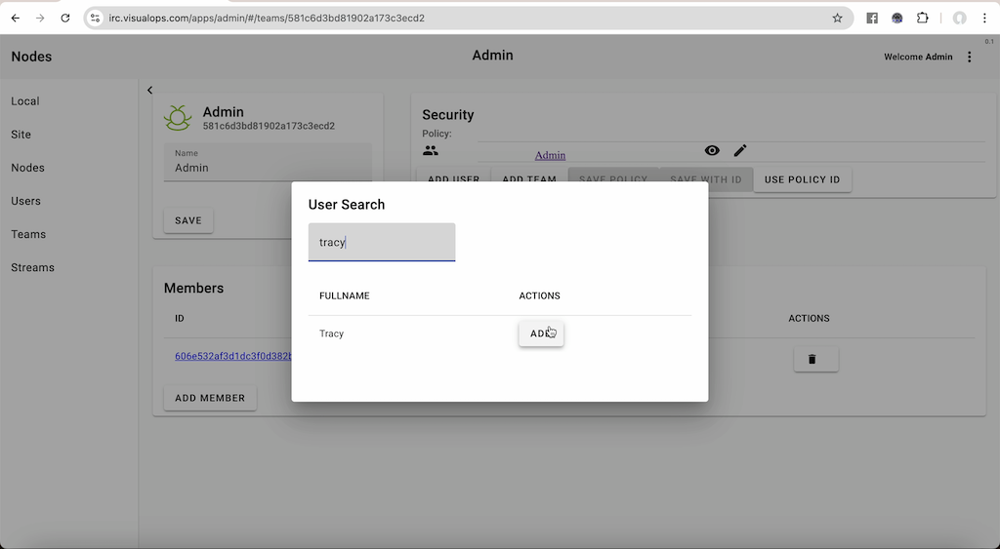
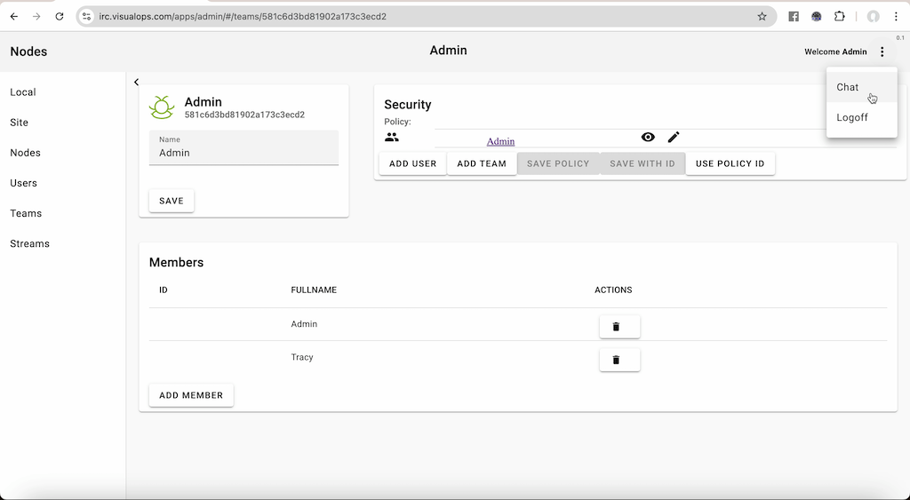
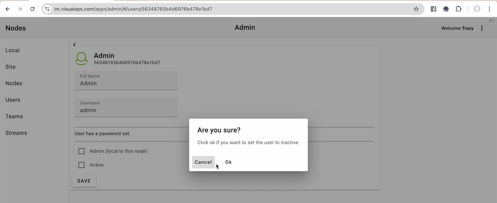
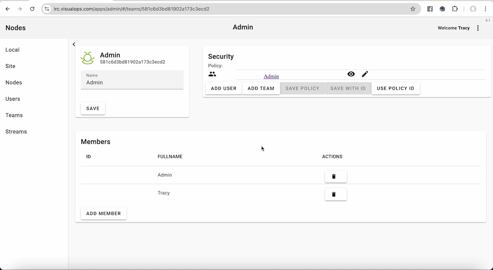
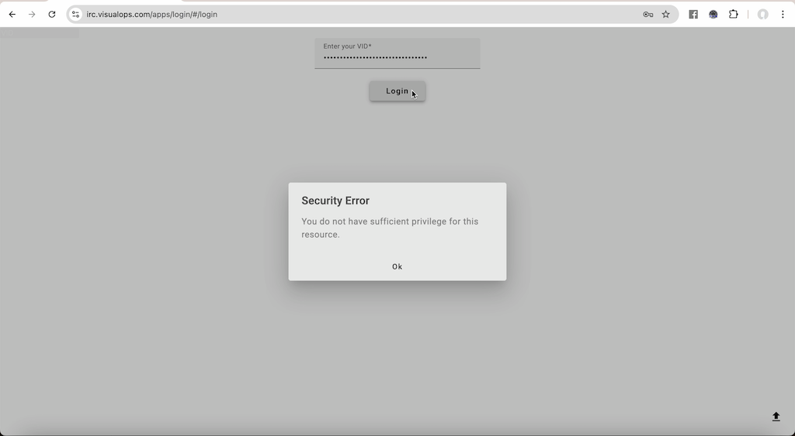

# Operations Manual

This manual describes getting a new Nodes server up and running for basic Web chat and IRC.

## The VID

Rather than a user name and password like other systems, a single long string like this:

Vk9m69J2RzcCcqIIgHgAMkMxOTg2MEYyRDlEQjVEREM1OTdGOTY5MjBGM0MwMzJCQkVCMTgxMzI3NTRFNEUx

Is used as a single access string to the system. VIDs can't be guessed and are too complicated
and long to be written down and typed in, so it's necessary for a user to take the time to 
save this away somewhere and upload it (which is a good thing).

Unlike centralised systems that have access to Email or other methods of verification (because they
are centralised), Nodes generates this VID and provides it to a user on first login. The user
then saves away the VID and has access on another device by providing the same VID.

New users are exclusively created by a KNOWN user inviting somebody new to the system, that
person logging in and chatting to the known user in a stream which is ISOLATED from all other
people. If the known user is satisfied, that user can provide more access to other things
on the server that they have access too. If the known user isn't satisfied that the user who
they are talking too is really who they think they are, they just delete the user and move on.

When a user invites another, Nodes remembers that and at a later date if the user they habve invited does
something malicious, then Nodes can provide information about users who are inviting malicious users.

Since all users have a very specific "slice" of the system that they can interact with, it's 
quite impossible for a user to really do any damage.

The actual source code for how VIDs are created is included in the "nodes" project. It's not a secret.

The password that is inside the VID is not saved in the Nodes database.

VIDs are global to all nodes. If you are a user on 1 nodes server and your user is shared with another,
you can use your VID to login to any of those servers, and you are the same person on every server.

## Creating yourself a user

The server comes with a database that configures a user called "Admin" that has full administration
privileges for the server.

Presented with this:

You can login to the server with this VID:

Vk9WNIdltNaXa0eOG9cAdmlzdWFsb3Bz

Obviously this isn't ideal because anybody with our software could use this VID to be an 
Admin :-)

After you login you are presented with:

### RESET the node

On the top right menu, choose "Admin" and you will see:

Now click "RESET NODE" and a new ID and security keys will be generated.

### Create a new stream

Now click on "Streams" on the left, then "ADD" and type in "Welcome" to create a new stream
called "Welcome":

### Editing security on a new stream

After clicking "Ok" you will see the new stream appear, and you can now click the little "wheel"
icon next to it to edit this stream.

In the security panel you will see a button called "ADD TEAM". Click that and then you will be presented
with a dialog where you can search for teams. Type "ev" and all the teams that have that in them will be
shown.

Now click the tick next to "Everybody" (which means ALL security) and you will see a new
line appear in the security for this stream.

Click "SAVE POLICY".

### Setting a stream to allow sharing

Click the "Allow stream to be shared..." checkbox and click "Save".

### Sharing a stream

Now choose "Chat" on the far right menu to switch back to chat and you will see the Welcome stream,
click that and then there is a little black "share" button at the top of the stream right in
the middle which you click and you will be presented with the share stream dialog.

The share link has actually already been copied to your clipboard, and if you were inviting people
to the system you would email them this link.

### Logging in as a new user with a share link

For now you are going to use the menu to "LOGOUT", and then paste the entire link that is on your clipboard
into the browser.

When you click enter you will be asked to type your full name, so do so.

Click "Login" and anothert dialog will be presented which provides you with your VID. It's already on
the clipboard so you can just save it somewhere. Remember you will need this!!!!

After you click "Continue" you will be in ready to go!

"

### Setting a new user to be an Admin

But, as Tracy, a new user you can't actually do anything meaningful except chat to the person that invited you,
in this case the default "Admin" user.

You can see this if you choose "Admin" from the menu.

So now we log out and log back in as "Admin" using the original VID. Then go into Admin and find the
"Tracy" user and click the "Admin" checkbox:

Click "Ok". The next step is to add "Tracy" to the "Admin" team so that tracy can see and edit everything.

Click on "Teams" and then click the "Edit" icon on "Admin".

Click on "ADD MEMBER" and type "tracy" in user search to find Tracy.

Now click "ADD" and tracy is a full fledged admin of the server.

### Removing the default "Admin" user

Now log out of the server and log back in as "Tracy" using the VID you saved away (that's why you 
needed to save it).

Now you want to disable the original "Admin" user so that that default user can't log on to the server
anymore.

Choose "Admin" on the menu, click on "Users" and then edit "Admin" and turn off
the "Admin" and "Active" flags.

You also want to remove the "Admin" user from the "Admin" team, so click on "Teams", and
click edit on the "Admin" team.

Click the trash can next to the "Admin" member down the bottom and you will see that only
"Tracy" is in the admin team.

Now if you log out and try to use the original VID you will be unable to log in.

Only "Tracy" can log on now.

### Next steps

Now you can send that link to other people you might want to chat with, and they can follow the same process
to get a VID and securely chat with you.

Remember to use a single stream to invite peopole at first just in case the link is leaked and others
might log in. If they pretend to be your friend they might not give a useful name and also when
you engage with them in the chat inside the "Welcome" stream you will probably be able to tell they
aren't valid.

If they aren't valid, simply remove them from the "Everybody" team and delete them and the will be kicked out.

