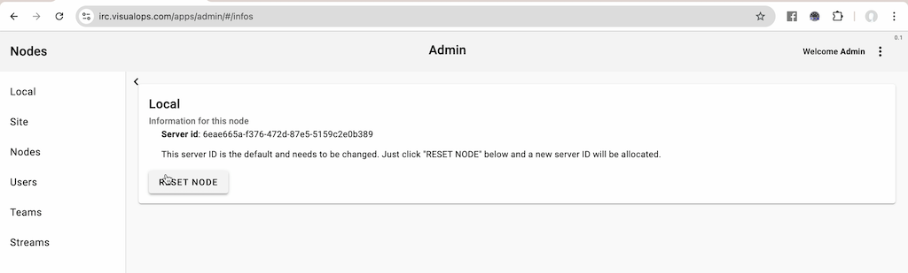
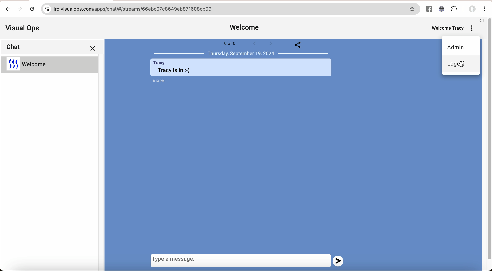

# Operations Manual

This manual describes getting a new Nodes server up and running for basic Web chat and IRC.

## The VID

Rather than a user name and password like other systems, a single long string like this:

Vk9m69J2RzcCcqIIgHgAMkMxOTg2MEYyRDlEQjVEREM1OTdGOTY5MjBGM0MwMzJCQkVCMTgxMzI3NTRFNEUx

Is used a single access string to the system. VIDs can't be guessed and are too complicated
and long to be written down and typed in, so it's necessary for a user to take the time to 
save this away somewhere and upload it (which is a good thing).

Unlike centralised systems that have access to Email or other methods of verification (because they
are centralised), Nodes generates this VID and provides it to a user on first login. The user
then saves away the VID and has access on another device by providing the same VID.

New users are exclusively created by a KNOWN user inviting somebody new to the system, that
person logging in and chatting to the known user in a stream which is ISOLATED from all other
people. If the known user is satisfied, that user can provide more access to other things
on the server that they have access too. If the known user isn't satisfied that the user who
they are talking too is really who they think they are, they just delete the user and move on.

When a user invites another, Nodes remembers that and at a later date if the user they habve invited does
something malicious, then Nodes can provide information about users who are inviting malicious users.

Since all users have a very specific "slice" of the system that they can interact with, it's 
quite impossible for a user to really do any damage.

The actual source code for how VIDs are created is included in the "nodes" project. It's not a secret.

The password that is inside the VID is not saved in the Nodes database.

VIDs are global to all nodes. If you are a user on 1 nodes server and your user is shared with another,
you can use your VID to login to any of those servers, and you are the same person on every server.

## Creating yourself a user

The server comes with a database that configures a user called "Admin" that has full administration
privileges for the server.

Presented with this:

You can login to the server with this VID:

Vk9WNIdltNaXa0eOG9cAdmlzdWFsb3Bz

Obviously this isn't ideal because anybody with our software could use this VID to be an 
Admin :-)

After you login you are presented with:

On the top right menu, choose "Admin" and you will see:

Now click "RESET NODE" and a new ID and security keys will be generated.

Now click on "Streams" on the left, then "ADD" and type in "Welcome" to create a new stream
called "Welcome":

## Login to your server using the well known Admin key

